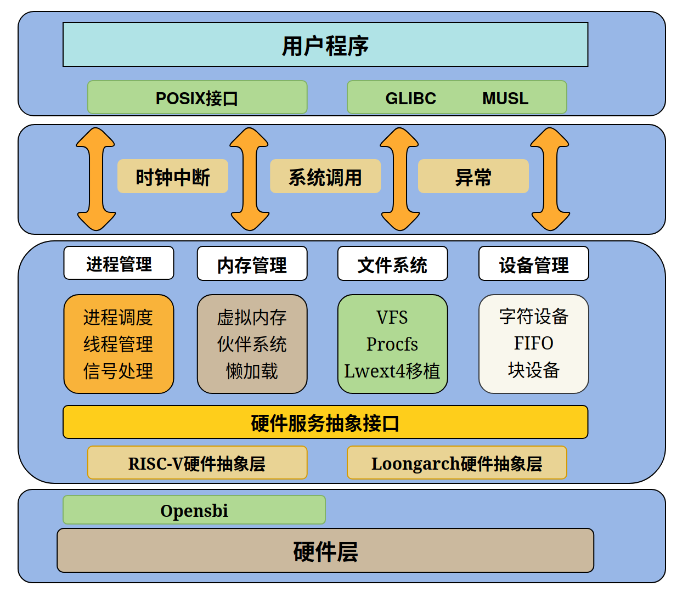

# SC7 🚀
<center>

</center>

## 🌟 文档中心 🌟

*   **初赛代码:** 🚀 请查看 `preliminary_contest` 分支
*   **初赛设计文档:** 📄 [SC7初赛设计文档](./doc/SC7初赛设计文档.pdf)
*   **初赛汇报资料:** 🎬 [PPT和视频](https://pan.baidu.com/s/1Sv-GNPEq07DWsxFS-EtMKw?pwd=w3gy) 提取码: `w3gy`

*   **决赛一阶段代码:** 🚀 请查看 `pre_final1` 分支
*   **决赛一阶段设计文档:** 📄 [SC7决赛设计文档](./doc/SC7决赛一阶段设计文档.pdf)和[决赛一阶段文档](./doc/决赛一阶段文档.md)
*   **决赛一阶段资料:** 🎬 [PPT和视频](https://pan.baidu.com/s/1d1PpB7ycfEk8ujbtQgrP7Q?pwd=xejc) 提取码: `xejc`

*   **决赛现场赛代码:** 🚀 请查看 `offline` 分支
*   **决赛现场赛文档:** 📄 [决赛现场赛文档](./doc/决赛现场赛文档.md)

## 💡 SC7 简介 💡

**SC7 (martCore7)** 是一款基于 MIT XV6 操作系统的教学用操作系统，使用 C 语言开发。

🌟 它同时支持 **RISC-V** 和 **LoongArch** 双架构！

<center>

</center>

## 🛠️ 如何运行 🛠️

### 🚀 通用构建 🚀

```bash
make all      # 一次性生成两种架构的镜像
```

### 🎯 RISC-V 架构 🎯

*   `make sbi`        生成使用 OpenSBI 的 RISC-V 架构镜像
*   `make sbi_qemu`   在调试模式下启动 RISC-V 镜像
*   `make run_sbi`    直接启动 RISC-V 镜像

### 🐉 LoongArch 架构 🐉

*   `make docker_la`  生成 LoongArch `-M virt` 的镜像
*   `make virt`       在调试模式下启动 LoongArch 镜像
*   `make run`        直接启动 LoongArch 镜像

## 🔧 工具链指南 🔧

您可以使用初赛提供的镜像，在镜像内部执行 `make all` 来进行编译。或者，您也可以按照以下信息在本地安装所需的 GCC 和 QEMU。

### 🌐 RISC-V 工具链 🌐

```bash
# GCC 版本
riscv64-linux-gnu-gcc --version
# GCC (Ubuntu 13.3.0-6ubuntu2~24.04) 13.3.0

# QEMU 版本
qemu-system-riscv64 --version
# QEMU emulator version 9.2.1

# GDB 版本
riscv64-unknown-elf-gdb --version
# GNU gdb (GDB) 13.2
```

### 🐲 LoongArch 工具链 🐲

```bash
# GCC 版本
loongarch64-linux-gnu-gcc --version
# GCC (GCC) 13.2.0

# QEMU 版本
qemu-system-loongarch64 --version
# QEMU emulator version 9.2.1
# 注意：请使用初赛镜像中的 QEMU 版本，不要使用 ls2k 的 QEMU。

# GDB 版本
loongarch64-linux-gnu-gdb --version
# GNU gdb (GDB) 12.0.50.20220221-git
```

## 📑 文档中心 📑
* [[开发环境搭建指南]](./doc/开发环境搭建指南.md)
* [[项目架构]](./doc/项目架构文档.md)

## 🧑‍🎓 项目人员 🧑‍🎓
武汉大学：

*   🦸李岩(2902299850@qq.com)
*   🦹陈震雄(zxiongchan@gmail.com)
*   🤴陆冕(1525980486@qq.com)
*   指导老师：🧑‍🏫李文海、👩‍🏫蔡朝晖

## 😍 参考 😍

*    [XV6](https://github.com/mit-pdos/xv6-public.git)：HAL 的 RISC-V 部分，HSAI 的中断异常处理
*    [XN6](https://gitlab.eduxiji.net/T202410486992576/OSKernel2024-2k1000la-xv6.git)：HAL 的 Loongarch 部分，HAL,HSAI 的设计思想
*    [AVX](https://gitlab.eduxiji.net/educg-group-22027-2376549/T202410487993009-4044) ：部分系统调用和 VMA(虚拟内存区域) 
*    [lwext4](https://github.com/gkostka/lwext4.git)：ext4文件系统实现，我们在此基础上进行改进使其open支持目录项为符号链接的情况
*    [Linux](https://github.com/torvalds/linux.git)：VFS思想和JHash算法
